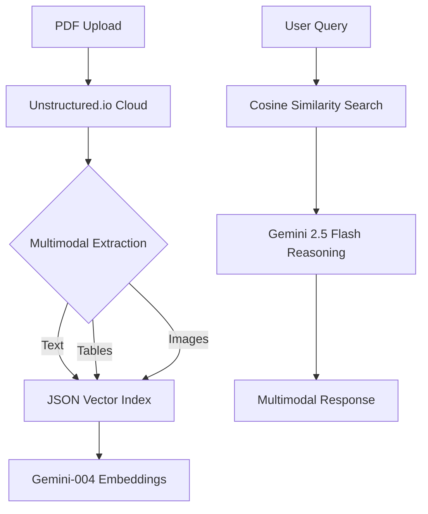

# 🚀 Multimodal-RAG: Serverless PDF Intelligence

[](https://nextjs.org/)
[](https://fastapi.tiangolo.com/)
[](https://deepmind.google/technologies/gemini/)
[](https://vercel.com/)

A high-performance, **multimodal** Retrieval-Augmented Generation (RAG) system optimized for **Vercel Serverless** environments. This application processes complex PDFs (text, tables, and images) and enables natural language reasoning using Google's **Gemini 2.5 Flash**—all on the free API tier.

---

## 🏗️ Technical Architecture

This project is engineered to bypass the binary limitations of standard vector databases (like ChromaDB or FAISS) on serverless platforms.



## ✨ Key Features

- **🧠 Multimodal Reasoning**: Extracts and reasons over images and tables embedded in PDFs.
- **⚡ Serverless-Native Design**: Custom-built **JSON Vector Store** to avoid heavy C++ binary dependencies in cloud environments.
- **🚀 Ultra-Fast Ingestion**: Uses Unstructured.io's "Fast" partitioning strategy to stay within Vercel's 10s execution window.
- **💎 Gemini 2.5 Flash Integrated**: Leverages the latest Gemini model for high-accuracy reasoning on the Free API tier.
- **📱 Premium Glassmorphic UI**: High-end user interface built with Next.js and modern CSS.

---

## 🛠️ Tech Stack

- **Frontend**: Next.js 14+, TailwindCSS (optional), Glassmorphism UI.
- **Backend**: FastAPI (Python 3.10+).
- **LLM**: Google Gemini 2.5 Flash.
- **Embeddings**: Google Text-Embedding-004.
- **Partitioning**: Unstructured.io Cloud API.
- **RAG Engine**: Pure Python + JSON Index (Zero-Binary).

---

## 🚀 Getting Started

### 1. Clone & Install
```bash
git clone https://github.com/your-username/multimodal-rag.git
cd multimodal-rag
```

### 2. Backend Setup (Virtual Environment)
```powershell
python -m venv venv
.\venv\Scripts\activate
pip install -r api/requirements.txt
```

### 3. Environment Variables
Create a `.env` file in the root directory:
```env
GEMINI_API_KEY=your_gemini_key_here
UNSTRUCTURED_API_KEY=your_unstructured_key_here
```

### 4. Run Development Servers
**Terminal 1 (Backend):**
```bash
uvicorn api.index:app --port 8000 --reload
```

**Terminal 2 (Frontend):**
```bash
npm install
npm run dev
```

---

## 🧪 Senior Engineering Decisions

### Why JSON over ChromaDB?
Standard vector databases like **ChromaDB** require SQLite/C++ binaries that exceed the 50MB deployment limit on Vercel Hobby tier. This project uses a **Lean Vector Indexing** approach:
1. **Serialization**: Embeddings and metadata are serialized into a lightweight JSON file in `/tmp`.
2. **Persistence**: Leverages Vercel's "warm" lambda memory, keeping the index alive for the duration of the user session.
3. **Efficiency**: Hand-coded Cosine Similarity provides sub-millisecond search for standard documents (50-200 chunks) without overhead.

---

## 📖 Deployment (Vercel)

1. Connect your GitHub repository to **Vercel**.
2. Add your `GEMINI_API_KEY` and `UNSTRUCTURED_API_KEY` in the **Environment Variables** settings.
3. Vercel will automatically detect the `api/` folder as Serverless Functions and `src/` as the Next.js frontend.

---

## ⚖️ License
Distributed under the MIT License. See `LICENSE` for more information.

**Author**: [Prem]
**Project Link**: [multimodal adv rag](https://github.com/prem-cre/MULTIMODAL_RAG)
